Course2_Final_Project
================
Melissinos Melissinos
2025-01-11

## Setup

``` r
library(ggplot2)
library(dplyr)
library(statsr)
library(scales)
library(tidyr)
library(reshape2)
library(extrafont)
library(cowplot)
library(gridExtra)
loadfonts(device = "win") 
loadfonts(device = "pdf")
```

``` r
load("gss.Rdata")
```

------------------------------------------------------------------------

## Description of sampling method

The dataset spans from 1972 to 2012 and includes observations collected
using a multi-stage area probability sampling method, which is a type of
random sampling.

Stages of the Sampling Process:

Selection of Primary Sampling Units (PSUs):

Definition: PSUs are large geographic areas like Standard Metropolitan
Statistical Areas (SMSAs) or non-metropolitan counties.

Random Selection: PSUs were randomly selected from the National Opinion
Research Center’s (NORC) Master Sample.

Stratification: Before selection, PSUs were stratified based on region,
age, and race to ensure diverse coverage.

Selection of Secondary Sampling Units:

Block Groups (BGs) and Enumeration Districts (EDs): Within each selected
PSU, BGs and EDs were randomly selected.

Stratification: These units were further stratified by race and income
to enhance representativeness.

Selection of Blocks:

Probability Proportional to Size (PPS): Blocks within the selected BGs
and EDs were selected using PPS sampling.

Purpose: Ensures areas with larger populations are proportionally
represented.

Selection of Households and Respondents:

1972-1976: Quota Sampling at the Block Level

Method: Within selected blocks, interviewers used quota sampling based
on sex, age, and employment status.

Purpose: Quotas ensured specific demographic proportions were met.

1977-2012: Full Probability Sampling

Method: Transitioned to full probability sampling without quota
sampling.

Random Selection: Households and respondents were randomly selected
within blocks.

Improvement: Enhanced randomness and representativeness.

Combination of Multiple Samples:

Integration Over Time: The sample includes observations from multiple
surveys conducted annually or biennially over four decades. Each year’s
data was collected using the appropriate sampling method for that
period.

Purpose: Combining data from multiple years allows for longitudinal
analysis and studying social trends.

------------------------------------------------------------------------

## Generalizability

2.  Decision on Generalizability to the US Population Generalizability:

Comprehensive Representation: The use of multi-stage random sampling
with stratification enhances representativeness. Combining multiple
samples increases dataset diversity and size.

Temporal Coverage: Data spanning 40 years provides insights into
long-term trends.

Conclusion on Generalizability: Yes, the results can be generalized to
the U.S. adult household population, but with caution due to potential
biases and changes over time.

------------------------------------------------------------------------

## Bias

3.  Potential Sources of Bias and Their Effects on Conclusions Potential
    Biases:

Quota Sampling Bias (1972-1976):

Issue: Introduced selection bias as interviewers might select more
accessible respondents within quotas.

Impact: Affects representativeness in those years.

Conclusion: Minimal impact but requires caution when interpreting data
from those years.

Non-Response Bias:

Issue: Underrepresentation of individuals not home during interview
times.

Impact: Affects estimates for certain subpopulations.

Conclusion: Efforts to reduce bias were made, but some may remain.

Coverage Bias:

Issue: Only included English-speaking respondents until 2006, excluding
non-English speakers.

Impact: Limits generalizability to non-English-speaking populations.

Conclusion: Inclusion of Spanish speakers from 2006 improved
representativeness.

------------------------------------------------------------------------

## Causality

4.  Explanation of Causality Causality:

Data Collection Method and Its Implications on Causality:

Observational Study Design: The GSS collects observational data through
interviews without experimental manipulation.

No Random Assignment to Treatments: Participants were not assigned to
different conditions or treatments.

Implications:

Associations, Not Causation: Allows for analysis of correlations and
associations between variables.

Confounding Variables: External factors may influence observed
relationships.

Conclusion on Causality: No, causality cannot be inferred from this
data. The observational nature and lack of random assignment mean that
causality cannot be established; only associations can be identified.
Researchers should focus on patterns and associations rather than
cause-and-effect relationships.

------------------------------------------------------------------------

## Summary

Sampling Method: Described the multi-stage area probability sampling
method, highlighting random sampling at each stage, and noted the
evolution from quota sampling to full probability sampling.

Generalizability: Concluded that the results can be generalized to the
U.S. adult household population, with caution due to potential biases
and changes over time.

Biases: Discussed potential biases, including quota sampling bias
(1972-1976), non-response and coverage biases, which necessitate caution
and appropriate adjustments when interpreting the results.

Causality: Determined that no random assignment to treatments was used,
and therefore, causality cannot be inferred from the data.

------------------------------------------------------------------------

## Research Question

How has public confidence in institutions changed across the decades
from the 1970s to the 2000s, and what associations exist between this
confidence and various societal concerns during these periods?

------------------------------------------------------------------------

## Personal touch

This question is based on my curiosity to find any associations between
the different decades and understand how the confidence of US society
evolved through the years.

------------------------------------------------------------------------

## Exploratory Data Analysis

------------------------------------------------------------------------

The following tables summarize the answers of americans about their
confidence in various institutions in 1970s.

    ##          confinan             conbus             conclerg   
    ##  A Great Deal:1756   A Great Deal:1155   A Great Deal:1563  
    ##  Only Some   :2509   Only Some   :2799   Only Some   :2358  
    ##  Hardly Any  : 495   Hardly Any  : 806   Hardly Any  : 839  
    ##          coneduc              confed             conlabor   
    ##  A Great Deal:1663   A Great Deal: 825   A Great Deal: 582  
    ##  Only Some   :2520   Only Some   :2862   Only Some   :2566  
    ##  Hardly Any  : 577   Hardly Any  :1073   Hardly Any  :1612  
    ##          conpress            conmedic             contv     
    ##  A Great Deal:1213   A Great Deal:2460   A Great Deal: 817  
    ##  Only Some   :2727   Only Some   :1951   Only Some   :2669  
    ##  Hardly Any  : 820   Hardly Any  : 349   Hardly Any  :1274  
    ##          conjudge             consci             conlegis   
    ##  A Great Deal:1668   A Great Deal:2082   A Great Deal: 728  
    ##  Only Some   :2403   Only Some   :2360   Only Some   :2981  
    ##  Hardly Any  : 689   Hardly Any  : 318   Hardly Any  :1051  
    ##          conarmy    
    ##  A Great Deal:1714  
    ##  Only Some   :2421  
    ##  Hardly Any  : 625

------------------------------------------------------------------------

The following tables summarize the answers of americans about their
confidence in various institutions in 1980s.

    ##          confinan             conbus             conclerg   
    ##  A Great Deal:2368   A Great Deal:2488   A Great Deal:2637  
    ##  Only Some   :5461   Only Some   :5751   Only Some   :4755  
    ##  Hardly Any  :1475   Hardly Any  :1065   Hardly Any  :1912  
    ##          coneduc              confed             conlabor   
    ##  A Great Deal:2904   A Great Deal:1593   A Great Deal:1010  
    ##  Only Some   :5384   Only Some   :5079   Only Some   :5066  
    ##  Hardly Any  :1016   Hardly Any  :2632   Hardly Any  :3228  
    ##          conpress            conmedic             contv     
    ##  A Great Deal:1715   A Great Deal:4663   A Great Deal:1255  
    ##  Only Some   :5497   Only Some   :4049   Only Some   :5448  
    ##  Hardly Any  :2092   Hardly Any  : 592   Hardly Any  :2601  
    ##          conjudge             consci             conlegis   
    ##  A Great Deal:3026   A Great Deal:4070   A Great Deal:1293  
    ##  Only Some   :5066   Only Some   :4607   Only Some   :5860  
    ##  Hardly Any  :1212   Hardly Any  : 627   Hardly Any  :2151  
    ##          conarmy    
    ##  A Great Deal:2947  
    ##  Only Some   :5006  
    ##  Hardly Any  :1351

------------------------------------------------------------------------

The following tables summarize the answers of americans about their
confidence in various institutions in 1990s.

    ##          confinan             conbus             conclerg   
    ##  A Great Deal:1417   A Great Deal:1850   A Great Deal:1787  
    ##  Only Some   :4234   Only Some   :4520   Only Some   :3870  
    ##  Hardly Any  :1575   Hardly Any  : 856   Hardly Any  :1569  
    ##          coneduc              confed             conlabor   
    ##  A Great Deal:1800   A Great Deal:1058   A Great Deal: 774  
    ##  Only Some   :4220   Only Some   :3674   Only Some   :4035  
    ##  Hardly Any  :1206   Hardly Any  :2494   Hardly Any  :2417  
    ##          conpress            conmedic             contv     
    ##  A Great Deal: 811   A Great Deal:3162   A Great Deal: 746  
    ##  Only Some   :3680   Only Some   :3460   Only Some   :3703  
    ##  Hardly Any  :2735   Hardly Any  : 604   Hardly Any  :2777  
    ##          conjudge             consci             conlegis   
    ##  A Great Deal:2395   A Great Deal:3038   A Great Deal: 727  
    ##  Only Some   :3750   Only Some   :3658   Only Some   :3873  
    ##  Hardly Any  :1081   Hardly Any  : 530   Hardly Any  :2626  
    ##          conarmy    
    ##  A Great Deal:2879  
    ##  Only Some   :3494  
    ##  Hardly Any  : 853

------------------------------------------------------------------------

The following tables summarize the answers of americans about their
confidence in various institutions in 2000s.

    ##          confinan             conbus             conclerg   
    ##  A Great Deal:1594   A Great Deal:1224   A Great Deal:1423  
    ##  Only Some   :3425   Only Some   :3771   Only Some   :3199  
    ##  Hardly Any  : 961   Hardly Any  : 985   Hardly Any  :1358  
    ##          coneduc              confed             conlabor   
    ##  A Great Deal:1625   A Great Deal: 950   A Great Deal: 741  
    ##  Only Some   :3459   Only Some   :2898   Only Some   :3540  
    ##  Hardly Any  : 896   Hardly Any  :2132   Hardly Any  :1699  
    ##          conpress            conmedic             contv     
    ##  A Great Deal: 584   A Great Deal:2369   A Great Deal: 559  
    ##  Only Some   :2825   Only Some   :2956   Only Some   :2874  
    ##  Hardly Any  :2571   Hardly Any  : 655   Hardly Any  :2547  
    ##          conjudge             consci             conlegis   
    ##  A Great Deal:1972   A Great Deal:2551   A Great Deal: 695  
    ##  Only Some   :3140   Only Some   :3005   Only Some   :3330  
    ##  Hardly Any  : 868   Hardly Any  : 424   Hardly Any  :1955  
    ##          conarmy    
    ##  A Great Deal:2879  
    ##  Only Some   :2482  
    ##  Hardly Any  : 619

------------------------------------------------------------------------

### Bar Plots

The following Bar plots show the proportion of each answer in the 1970s.

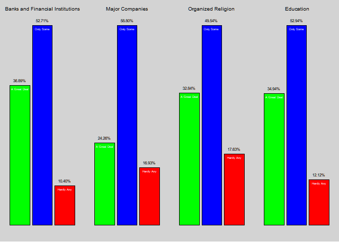<!-- -->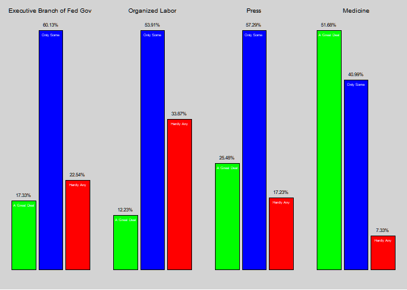<!-- -->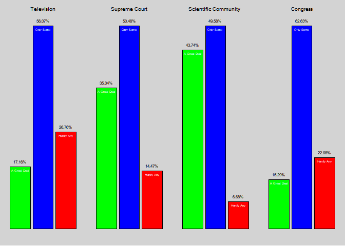<!-- -->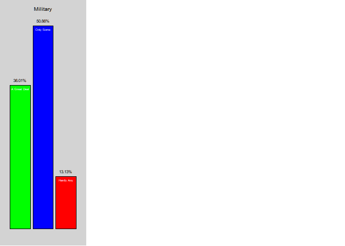<!-- -->

------------------------------------------------------------------------

The following Bar plots show the proportion of each answer in the 1980s.

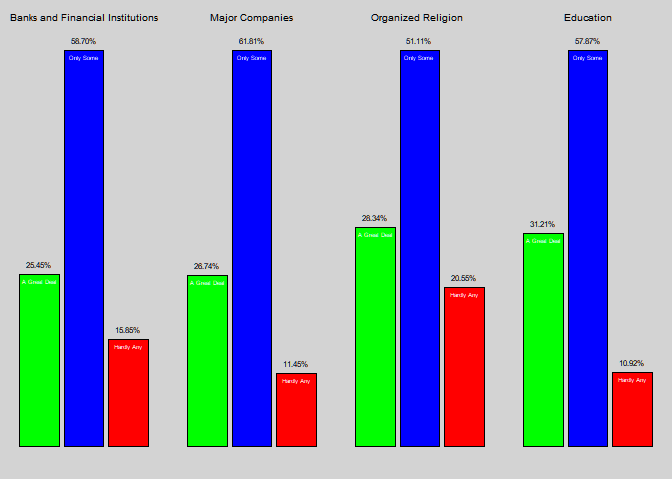<!-- -->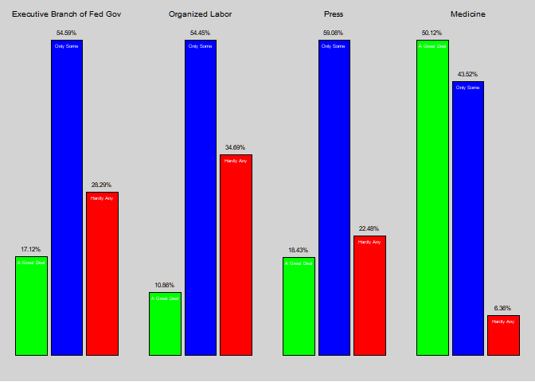<!-- -->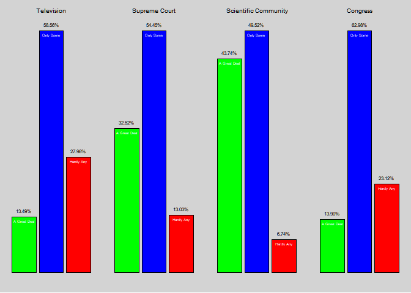<!-- -->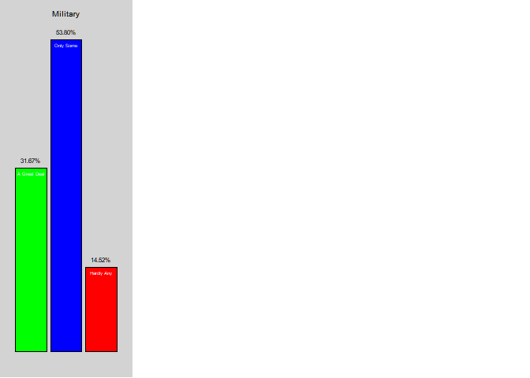<!-- -->

------------------------------------------------------------------------

The following Bar plots show the proportion of each answer in the 1990s.

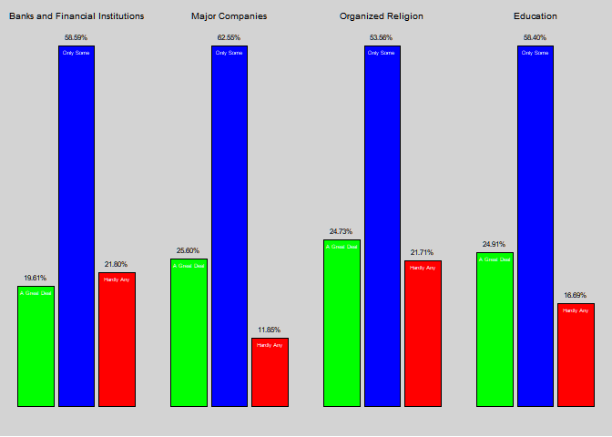<!-- -->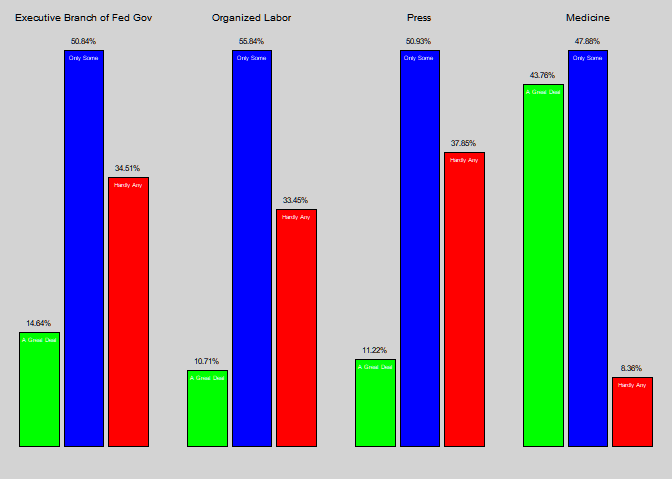<!-- -->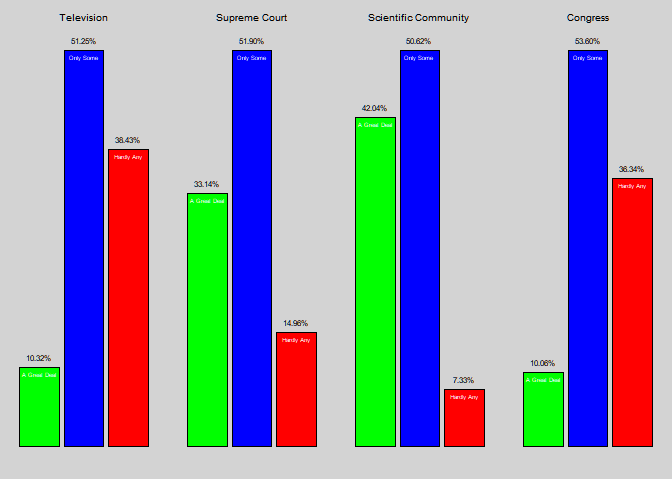<!-- -->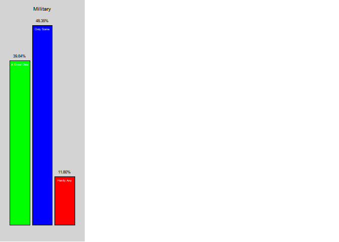<!-- -->

------------------------------------------------------------------------

The following Bar plots show the proportion of each answer in the 2000s.

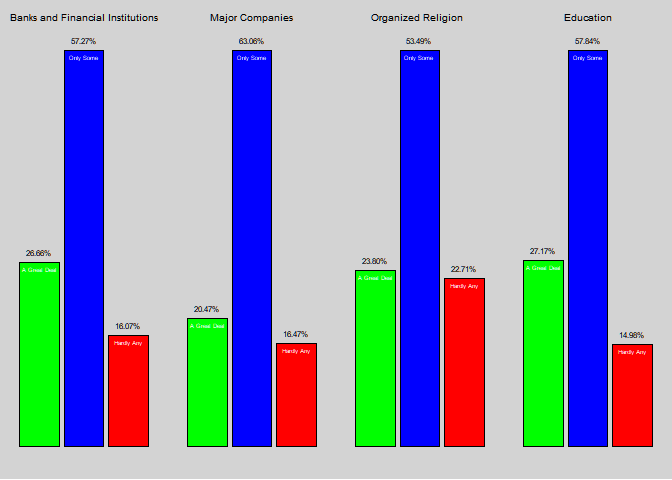<!-- -->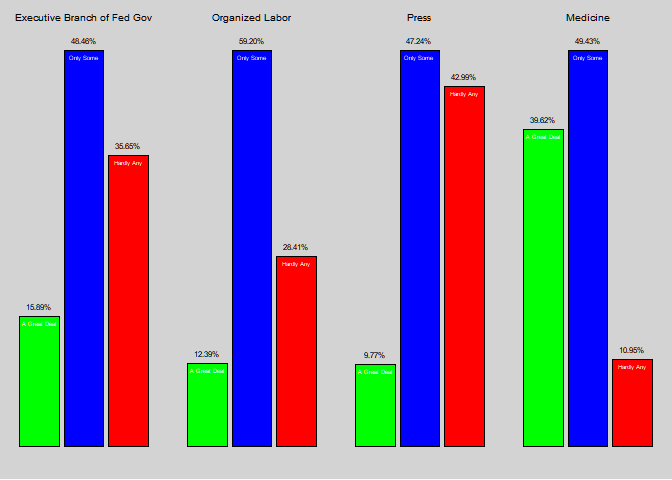<!-- -->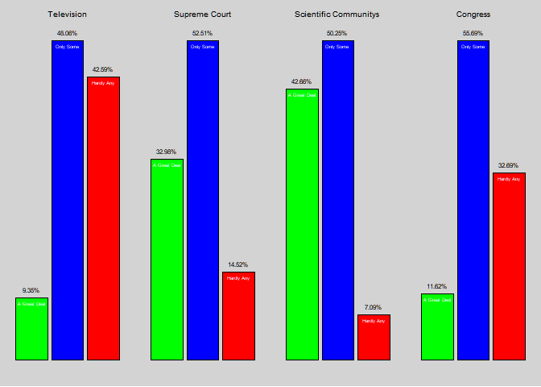<!-- -->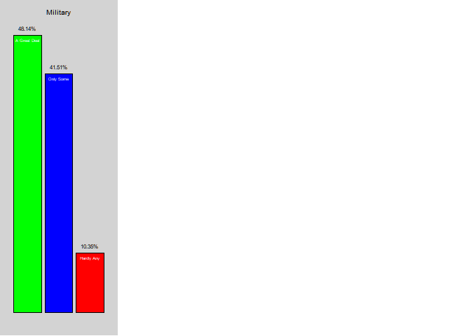<!-- -->

------------------------------------------------------------------------

### Heat Maps

The following Heat maps show the change in proportions of each answer in
every Institution through the decades. At the end follows a table with
description of every variable.

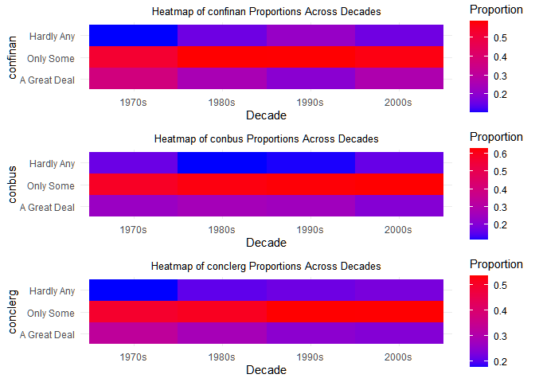<!-- -->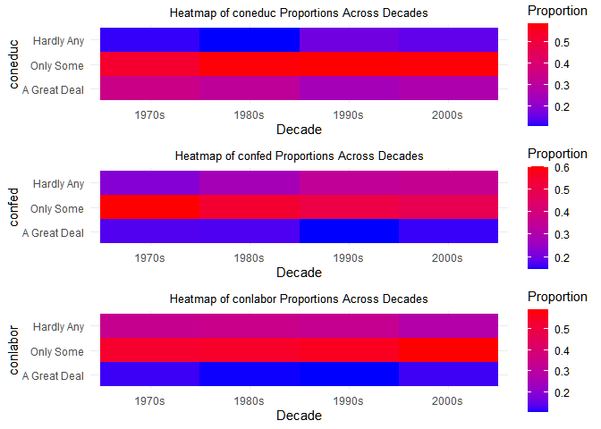<!-- -->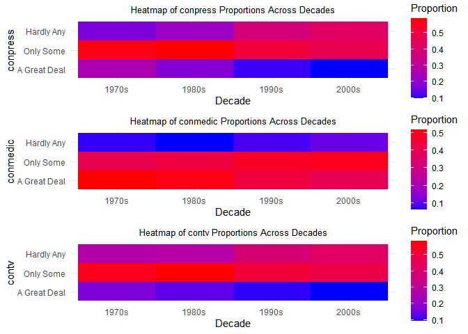<!-- -->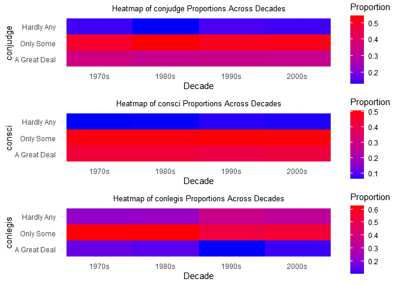<!-- -->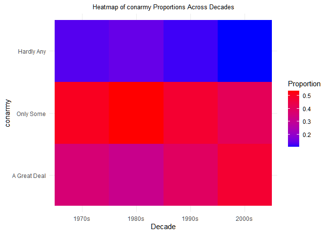<!-- -->

------------------------------------------------------------------------

Confidence in Institutions  
confinan: confidence in banks and financial institutions  
conbus: confidence in major companies  
conclerg: confidence in organized religion  
coneduc: confidence in education  
confed: confidence in executive branch of federal government  
conlabor: confidence in organized labor  
conpress: confidence in press  
conmedic: confidence in medicine  
contv: confidence in television  
conjudge: confidence in United States Supreme Court  
consci: confidence in scientific community  
conlegis: confidence in Congress  
conarmy: confidence in military

------------------------------------------------------------------------

### Bar Plots Interpretations

#### Interpretation of Bar Plots on Confidence in Banks and Financial Institutions(1970s to 2000s)

The bar plots provide a visual representation of the levels of public
confidence in banks and financial institutions over four decades: the
1970s, 1980s, 1990s, and 2000s.

Confidence Levels: Each bar represents the proportion of respondents
expressing different levels of confidence: “A Great Deal,” “Only Some,”
and “Hardly Any.”

High Confidence (“A Great Deal”):

1970s: Approximately 36.89% of respondents had a high level of
confidence in banks and financial institutions.

1980s: The proportion decreased to 25.45%.

1990s: Further decrease to 19.61%.

2000s: Slight increase to 26.66%.

Moderate Confidence (“Only Some”):

1970s: Around 52.71% of respondents expressed moderate confidence.

1980s: The proportion increased to 58.70%.

1990s: The percentage remained relatively stable at 58.59%.

2000s: Slight decrease to 57.27%.

Low Confidence (“Hardly Any”):

1970s: Approximately 10.40% of respondents reported low confidence.

1980s: The proportion increased to 15.85%.

1990s: Further increase to 21.80%.

2000s: Slight decrease to 16.07%.

Key Observations: Decline in High Confidence: There is a noticeable
decline in the proportion of respondents with high confidence in banks
and financial institutions from the 1970s (36.89%) to the 1990s
(19.61%), with a slight recovery in the 2000s (26.66%).

Stability in Moderate Confidence: Moderate confidence has remained the
most common response across all decades, showing slight fluctuations but
staying around 52-58%.

Increase in Low Confidence: There is a clear upward trend in the
proportion of respondents with low confidence, rising from 10.40% in the
1970s to 21.80% in the 1990s, followed by a slight decrease in the 2000s
(16.07%).

------------------------------------------------------------------------

#### Interpretation of Bar Plots on Confidence in Major Companies Institutionss (1970s to 2000s)

The bar plots provide a visual representation of the levels of public
confidence in major companies over four decades: the 1970s, 1980s,
1990s, and 2000s.

Confidence Levels: Each bar represents the proportion of respondents
expressing different levels of confidence: “A Great Deal,” “Only Some,”
and “Hardly Any.”

High Confidence (“A Great Deal”):

1970s: Approximately 24.26% of respondents had a high level of
confidence in major companies (43 individuals).

1980s: The proportion slightly increased to 26.74% (82 individuals).

1990s: There was a slight decrease to 25.60% (121 individuals).

2000s: Further decrease to 20.47% (5 individuals).

Moderate Confidence (“Only Some”):

1970s: Around 58.80% of respondents expressed moderate confidence (44
individuals).

1980s: The proportion increased to 61.81% (83 individuals).

1990s: Slight increase to 62.55% (122 individuals).

2000s: Continued increase to 63.06% (6 individuals).

Low Confidence (“Hardly Any”):

1970s: Approximately 16.93% of respondents reported low confidence (45
individuals).

1980s: The proportion decreased to 11.45% (84 individuals).

1990s: Slight increase to 11.85% (123 individuals).

2000s: Increase to 16.47% (7 individuals).

Key Observations: Fluctuations in High Confidence: The proportion of
respondents with high confidence in major companies saw a slight
increase from the 1970s (24.26%) to the 1980s (26.74%), followed by a
decrease in the 1990s (25.60%) and a further decline in the 2000s
(20.47%).

Consistent Moderate Confidence: Moderate confidence has consistently
been the most common response, showing a steady increase from 58.80% in
the 1970s to 63.06% in the 2000s.

Fluctuations in Low Confidence: There is a slight decrease in low
confidence from the 1970s (16.93%) to the 1980s (11.45%), followed by an
increase in the 1990s (11.85%) and a further increase in the 2000s
(16.47%).

------------------------------------------------------------------------

#### Interpretation of Bar Plots on Confidence in Organized Religions (1970s to 2000s)

The bar plots depict the proportions of respondents expressing different
levels of confidence in educational institutions across four decades:
the 1970s, 1980s, 1990s, and 2000s.

Low Confidence (“Hardly Any”):

1970s: Approximately 17.63% of respondents expressed low confidence.

1980s: The proportion increased to 20.55%.

1990s: Further increase to 21.71%.

2000s: Slight increase to 22.71%.

Moderate Confidence (“Only Some”):

1970s: Around 49.54% of respondents had moderate confidence.

1980s: Slight increase to 51.11%.

1990s: The proportion increased to 53.56%.

2000s: The percentage remained stable at approximately 53.49%.

High Confidence (“A Great Deal”):

1970s: Approximately 32.84% of respondents expressed high confidence.

1980s: Decreased to 28.34%.

1990s: Further decrease to 24.73%.

2000s: A slight decrease to 23.80%.

Key Observations: Decline in High Confidence: There is a noticeable
decline in the proportion of respondents with high confidence in
Organized Religion from the 1970s (32.84%) to the 2000s (23.80%).

Increase in Low Confidence: The proportion of respondents with low
confidence has increased steadily from the 1970s (17.63%) to the 2000s
(22.71%).

Stable Moderate Confidence: Moderate confidence has remained the
dominant response across all decades, ranging from 49.54% in the 1970s
to 53.49% in the 2000s.

------------------------------------------------------------------------

#### Interpretation of Bar Plots on Confidence in Education System (1970s to 2000s)

The bar plots provide a visual representation of the levels of public
confidence in the education system over four decades: the 1970s, 1980s,
1990s, and 2000s.

Confidence Levels: Each bar represents the proportion of respondents
expressing different levels of confidence: “A Great Deal,” “Only Some,”
and “Hardly Any.”

High Confidence (“A Great Deal”):

1970s: Approximately 34.94% of respondents had a high level of
confidence in educational institutions.

1980s: The proportion decreased slightly to 31.21%.

1990s: Further decrease to 24.91%.

2000s: A minor recovery to 27.17%.

Moderate Confidence (“Only Some”):

1970s: Around 52.94% of respondents expressed moderate confidence.

1980s: The proportion increased to 57.87%.

1990s: A slight increase to 58.40%.

2000s: The percentage remained stable at approximately 57.84%.

Low Confidence (“Hardly Any”):

1970s: Approximately 12.12% of respondents reported low confidence.

1980s: The proportion decreased slightly to 10.92%.

1990s: A notable increase to 16.69%.

2000s: Slight decrease to 14.98%.

Key Observations: Decline in High Confidence: There is a clear decline
in the proportion of respondents with high confidence in educational
system from the 1970s (34.94%) to the 1990s (24.91%), followed by a
slight recovery in the 2000s (27.17%).

Increase in Moderate Confidence: Moderate confidence has seen a gradual
increase from 52.94% in the 1970s to around 58.40% in the 1990s,
remaining stable in the 2000s.

Fluctuations in Low Confidence: The proportion of respondents with low
confidence decreased from the 1970s (12.12%) to the 1980s (10.92%), but
then saw an increase in the 1990s (16.69%), followed by a slight
decrease in the 2000s (14.98%).

------------------------------------------------------------------------

#### Interpretation of Bar Plots on Confidence in Executive branch of Federal Goverment (1970s to 2000s)

The bar plots provide a visual representation of the levels of public
confidence in the executive branch of the federal government over four
decades: the 1970s, 1980s, 1990s, and 2000s.

Confidence Levels: Each bar represents the proportion of respondents
expressing different levels of confidence: “A Great Deal,” “Only Some,”
and “Hardly Any.”

High Confidence (“A Great Deal”):

1970s: Approximately 17.33% of respondents had a high level of
confidence in the executive branch.

1980s: The proportion remained relatively stable at 17.12%.

1990s: A slight decrease to 14.64%.

2000s: A minor recovery to 15.88%.

Moderate Confidence (“Only Some”):

1970s: Around 60.13% of respondents expressed moderate confidence.

1980s: The proportion decreased to 54.59%.

1990s: Further decrease to 50.84%.

2000s: Continued decrease to 48.46%.

Low Confidence (“Hardly Any”):

1970s: Approximately 22.54% of respondents reported low confidence.

1980s: The proportion increased to 28.29%.

1990s: A significant increase to 34.51%.

2000s: Further increase to 35.65%.

Key Observations: Stability and Decline in High Confidence: The
proportion of respondents with high confidence in the executive branch
remained stable around 17% from the 1970s to the 1980s, followed by a
decline in the 1990s (14.64%) and a minor recovery in the 2000s
(15.88%).

Gradual Decrease in Moderate Confidence: Moderate confidence shows a
steady decline from 60.13% in the 1970s to 48.46% in the 2000s,
indicating a growing dissatisfaction over the decades.

Increase in Low Confidence: There is a noticeable increase in the
proportion of respondents with low confidence, rising from 22.54% in the
1970s to 35.65% in the 2000s, reflecting a growing lack of trust in the
executive branch.

------------------------------------------------------------------------

#### Interpretation of Bar Plots on Confidence in Organized Labor (1970s to 2000s)

The bar plots provide a visual representation of the levels of public
confidence in organized labor over four decades: the 1970s, 1980s,
1990s, and 2000s.

Confidence Levels: Each bar represents the proportion of respondents
expressing different levels of confidence: “A Great Deal,” “Only Some,”
and “Hardly Any.”

High Confidence (“A Great Deal”):

1970s: Approximately 12.23% of respondents had a high level of
confidence in organized labor.

1980s: The proportion decreased slightly to 10.86%.

1990s: The percentage remained relatively stable at 10.71%.

2000s: A minor increase to 12.39%.

Moderate Confidence (“Only Some”):

1970s: Around 53.91% of respondents expressed moderate confidence.

1980s: The proportion remained stable at 54.45%.

1990s: Increased slightly to 55.84%.

2000s: The percentage increased further to 59.20%.

Low Confidence (“Hardly Any”):

1970s: Approximately 33.87% of respondents reported low confidence.

1980s: The proportion increased slightly to 34.69%.

1990s: A slight decrease to 33.45%.

2000s: Decreased further to 28.41%.

Key Observations: Stability in High Confidence: The proportion of
respondents with high confidence in organized labor remained relatively
stable around 10-12% across the decades, with a slight increase in the
2000s.

Consistent Moderate Confidence: Moderate confidence has consistently
been the dominant response, ranging from 53.91% in the 1970s to 59.20%
in the 2000s, indicating stable and gradually increasing moderate trust.

Fluctuations in Low Confidence: There is a notable decrease in low
confidence from the 1970s (33.87%) to the 2000s (28.41%), reflecting a
slight improvement in public perception of organized labor.

These observations provide a detailed view of how public confidence in
organized labor has evolved over the decades, highlighting key trends
and shifts in public opinion.

------------------------------------------------------------------------

#### Interpretation of Bar Plots on Confidence in Press (1970s to 2000s)

The bar plots provide a visual representation of the levels of public
confidence in the press over four decades: the 1970s, 1980s, 1990s, and
2000s.

Confidence Levels: Each bar represents the proportion of respondents
expressing different levels of confidence: “A Great Deal,” “Only Some,”
and “Hardly Any.”

High Confidence (“A Great Deal”):

1970s: Approximately 25.48% of respondents had a high level of
confidence in the press.

1980s: The proportion decreased to 18.43%.

1990s: Further decrease to 11.22%.

2000s: Continued decline to 9.77%.

Moderate Confidence (“Only Some”):

1970s: Around 57.29% of respondents expressed moderate confidence.

1980s: The proportion remained stable at 59.08%.

1990s: Decreased to 50.93%.

2000s: Continued decrease to 47.24%.

Low Confidence (“Hardly Any”):

1970s: Approximately 17.23% of respondents reported low confidence.

1980s: The proportion increased to 22.48%.

1990s: Significant increase to 37.85%.

2000s: Further increase to 42.99%.

Key Observations: Decline in High Confidence: There is a noticeable
decline in the proportion of respondents with high confidence in the
press from the 1970s (25.48%) to the 2000s (9.77%).

Fluctuations in Moderate Confidence: Moderate confidence remained
relatively stable in the 1970s and 1980s (around 57-59%), but saw a
significant decrease in the 1990s (50.93%) and continued to decline in
the 2000s (47.24%).

Increase in Low Confidence: There is a clear upward trend in the
proportion of respondents with low confidence, rising from 17.23% in the
1970s to 42.99% in the 2000s, indicating growing public skepticism
towards the press over the decades.

------------------------------------------------------------------------

#### Interpretation of Bar Plots on Confidence in Medicine (1970s to 2000s)

The bar plots provide a visual representation of the levels of public
confidence in medicine over four decades: the 1970s, 1980s, 1990s, and
2000s.

Confidence Levels: Each bar represents the proportion of respondents
expressing different levels of confidence: “A Great Deal,” “Only Some,”
and “Hardly Any.”

High Confidence (“A Great Deal”):

1970s: Approximately 51.68% of respondents had a high level of
confidence in medicine.

1980s: The proportion remained relatively stable at 50.12%.

1990s: There was a notable decrease to 43.76%.

2000s: Continued decline to 39.62%.

Moderate Confidence (“Only Some”):

1970s: Around 40.99% of respondents expressed moderate confidence.

1980s: The proportion slightly increased to 43.52%.

1990s: The percentage further increased to 47.88%.

2000s: Continued increase to 49.43%.

Low Confidence (“Hardly Any”):

1970s: Approximately 7.33% of respondents reported low confidence.

1980s: The proportion decreased slightly to 6.36%.

1990s: A slight increase to 8.36%.

2000s: Continued increase to 10.95%.

Key Observations: Decline in High Confidence: There is a noticeable
decline in the proportion of respondents with high confidence in
medicine from the 1970s (51.68%) to the 2000s (39.62%).

Gradual Increase in Moderate Confidence: Moderate confidence has
gradually increased over the decades, rising from 40.99% in the 1970s to
49.43% in the 2000s.

Fluctuations in Low Confidence: While low confidence was relatively low
in the 1970s and 1980s, it has seen a slight increase in the 1990s and
2000s, indicating a growing segment of the population with diminished
confidence in medicine.

------------------------------------------------------------------------

#### Interpretation of Bar Plots on Confidence in Television (1970s to 2000s)

The bar plots provide a visual representation of the levels of public
confidence in television over four decades: the 1970s, 1980s, 1990s, and
2000s.

Confidence Levels: Each bar represents the proportion of respondents
expressing different levels of confidence: “A Great Deal,” “Only Some,”
and “Hardly Any.”

High Confidence (“A Great Deal”):

1970s: Approximately 17.16% of respondents had a high level of
confidence in television.

1980s: The proportion decreased to 13.49%.

1990s: Further decrease to 10.32%.

2000s: Continued decline to 9.35%.

Moderate Confidence (“Only Some”):

1970s: Around 56.07% of respondents expressed moderate confidence.

1980s: The proportion remained relatively stable at 58.56%.

1990s: Decreased to 51.25%.

2000s: Continued decrease to 48.06%.

Low Confidence (“Hardly Any”):

1970s: Approximately 26.76% of respondents reported low confidence.

1980s: The proportion increased slightly to 27.96%.

1990s: Significant increase to 38.43%.

2000s: Further increase to 42.59%.

Key Observations: Decline in High Confidence: There is a noticeable
decline in the proportion of respondents with high confidence in
television from the 1970s (17.16%) to the 2000s (9.35%).

Fluctuations in Moderate Confidence: Moderate confidence remained
relatively stable in the 1970s and 1980s (around 56-58%), but saw a
significant decrease in the 1990s (51.25%) and continued to decline in
the 2000s (48.06%).

Increase in Low Confidence: There is a clear upward trend in the
proportion of respondents with low confidence, rising from 26.76% in the
1970s to 42.59% in the 2000s, indicating growing public skepticism
towards television over the decades.

------------------------------------------------------------------------

#### Interpretation of Bar Plots on Confidence in the Supreme Court (1970s to 2000s)

The bar plots provide a visual representation of the levels of public
confidence in the Supreme Court over four decades: the 1970s, 1980s,
1990s, and 2000s.

Confidence Levels: Each bar represents the proportion of respondents
expressing different levels of confidence: “A Great Deal,” “Only Some,”
and “Hardly Any.”

High Confidence (“A Great Deal”):

1970s: Approximately 35.04% of respondents had a high level of
confidence in the Supreme Court.

1980s: The proportion slightly decreased to 32.52%.

1990s: There was a slight increase to 33.14%.

2000s: The proportion remained relatively stable at 32.98%.

Moderate Confidence (“Only Some”):

1970s: Around 50.48% of respondents expressed moderate confidence.

1980s: The proportion increased to 54.45%.

1990s: Slight decrease to 51.90%.

2000s: Continued stability with a slight increase to 52.51%.

Low Confidence (“Hardly Any”):

1970s: Approximately 14.47% of respondents reported low confidence.

1980s: The proportion decreased slightly to 13.03%.

1990s: A slight increase to 14.96%.

2000s: The proportion remained relatively stable at.

Key Observations: Stability in High Confidence: The proportion of
respondents with high confidence in the Supreme Court remained
relatively stable around 32-35% across the decades, with minor
fluctuations.

Moderate Confidence: Moderate confidence has consistently been the most
common response, showing slight fluctuations but remaining around
50-54%.

Low Confidence: There is a slight fluctuation in the proportion of
respondents with low confidence, ranging from 13.03% in the 1980s to
14.96% in the 1990s, but overall remaining relatively stable.

------------------------------------------------------------------------

#### Interpretation of Bar Plots on Confidence in the Scientific Community (1970s to 2000s)

The bar plots provide a visual representation of the levels of public
confidence in the scientific community over four decades: the 1970s,
1980s, 1990s, and 2000s.

Confidence Levels: Each bar represents the proportion of respondents
expressing different levels of confidence: “A Great Deal,” “Only Some,”
and “Hardly Any.”

High Confidence (“A Great Deal”):

1970s: Approximately 43.74% of respondents had a high level of
confidence in the scientific community.

1980s: The proportion remained stable at 43.74%.

1990s: Slight decrease to 42.04%.

2000s: Minor increase to 42.66%.

Moderate Confidence (“Only Some”):

1970s: Around 49.58% of respondents expressed moderate confidence.

1980s: The proportion remained stable at 49.52%.

1990s: Slight increase to 50.62%.

2000s: Minor decrease to 50.25%.

Low Confidence (“Hardly Any”):

1970s: Approximately 6.68% of respondents reported low confidence.

1980s: The proportion remained stable at 6.74%.

1990s: Slight increase to 7.33%.

2000s: Minor decrease to 7.09%.

Key Observations: Stability in High Confidence: The proportion of
respondents with high confidence in the scientific community remained
relatively stable around 42-44% across the decades.

Consistent Moderate Confidence: Moderate confidence has consistently
been the most common response, with slight fluctuations around 49-50%.

Low Confidence: The proportion of respondents with low confidence has
remained low and relatively stable, with minor fluctuations from 6.68%
in the 1970s to 7.09% in the 2000s.

------------------------------------------------------------------------

#### Interpretation of Bar Plots on Confidence in Congress (1970s to 2000s)

The bar plots provide a visual representation of the levels of public
confidence in Congress over four decades: the 1970s, 1980s, 1990s, and
2000s.

Confidence Levels: Each bar represents the proportion of respondents
expressing different levels of confidence: “A Great Deal,” “Only Some,”
and “Hardly Any.”

High Confidence (“A Great Deal”):

1970s: Approximately 15.29% of respondents had a high level of
confidence in Congress .

1980s: The proportion slightly decreased to 13.90%.

1990s: Further decrease to 10.06%.

2000s: Slight recovery to 11.62%.

Moderate Confidence (“Only Some”):

1970s: Around 62.63% of respondents expressed moderate confidence.

1980s: The proportion remained stable at 62.98%.

1990s: Noticeable decrease to 53.60%.

2000s: Slight increase to 55.69%.

Low Confidence (“Hardly Any”):

1970s: Approximately 22.08% of respondents reported low confidence.

1980s: The proportion increased slightly to 23.12%.

1990s: Significant increase to 36.34%.

2000s: Slight decrease to 32.69%.

Key Observations: Decline in High Confidence: There is a noticeable
decline in the proportion of respondents with high confidence in
Congress from the 1970s (15.29%) to the 1990s (10.06%), with a minor
recovery in the 2000s (11.62%).

Fluctuations in Moderate Confidence: Moderate confidence remained stable
in the 1970s and 1980s (around 62-63%), but saw a significant decrease
in the 1990s (53.60%) followed by a slight increase in the 2000s
(55.69%).

Increase in Low Confidence: There is a clear upward trend in the
proportion of respondents with low confidence, rising from 22.08% in the
1970s to 36.34% in the 1990s, followed by a slight decrease in the 2000s
(32.69%).

------------------------------------------------------------------------

#### Interpretation of Bar Plots on Confidence in the Military (1970s to 2000s)

The bar plots provide a visual representation of the levels of public
confidence in the military over four decades: the 1970s, 1980s, 1990s,
and 2000s.

Confidence Levels: Each bar represents the proportion of respondents
expressing different levels of confidence: “A Great Deal,” “Only Some,”
and “Hardly Any.”

High Confidence (“A Great Deal”):

1970s: Approximately 36.01% of respondents had a high level of
confidence in the military.

1980s: The proportion slightly decreased to 31.67%.

1990s: There was a notable increase to 39.84%.

2000s: Significant increase to 48.14%.

Moderate Confidence (“Only Some”):

1970s: Around 50.86% of respondents expressed moderate confidence.

1980s: The proportion increased to 53.80%.

1990s: Slight decrease to 48.35%.

2000s: Further decrease to 41.51%.

Low Confidence (“Hardly Any”):

1970s: Approximately 13.13% of respondents reported low confidence.

1980s: The proportion slightly increased to 14.52%.

1990s: Decrease to 11.80%.

2000s: Further decrease to 10.35%.

Key Observations: Increase in High Confidence: There is a significant
increase in the proportion of respondents with high confidence in the
military from the 1970s (36.01%) to the 2000s (48.14%).

Fluctuations in Moderate Confidence: Moderate confidence remained
relatively stable in the 1970s and 1980s (around 50-53%), but saw a
decrease in the 1990s (48.35%) and continued to decrease in the 2000s
(41.51%).

Decrease in Low Confidence: There is a noticeable decrease in the
proportion of respondents with low confidence, falling from 13.13% in
the 1970s to 10.35% in the 2000s, indicating growing trust in the
military over the decades.

------------------------------------------------------------------------

## Inference

### Chi Square Test results

    ## $variable_name
    ## [1] "confinan"
    ## 
    ## $chi_square_result
    ## 
    ##  Pearson's Chi-squared test
    ## 
    ## data:  contingency_table
    ## X-squared = 586, df = 6, p-value < 2.2e-16
    ## 
    ## 
    ## $std_residuals
    ##        
    ##         A Great Deal    Only Some   Hardly Any
    ##   1970s  18.53222577  -7.06524897 -12.52257597
    ##   1980s  -1.92739599   3.32304394  -2.14465615
    ##   1990s -14.78611004   2.56967660  14.07643334
    ##   2000s   0.97815399  -0.06691406  -1.06848784

    ## $variable_name
    ## [1] "conbus"
    ## 
    ## $chi_square_result
    ## 
    ##  Pearson's Chi-squared test
    ## 
    ## data:  contingency_table
    ## X-squared = 194.12, df = 6, p-value < 2.2e-16
    ## 
    ## 
    ## $std_residuals
    ##        
    ##         A Great Deal  Only Some Hardly Any
    ##   1970s   -0.6463933 -4.6157990  7.3536982
    ##   1980s    5.8188492  0.1359948 -7.5039412
    ##   1990s    2.2334077  1.6227726 -5.1060079
    ##   2000s   -8.4566077  2.3477946  7.2981715

    ## $variable_name
    ## [1] "conclerg"
    ## 
    ## $chi_square_result
    ## 
    ##  Pearson's Chi-squared test
    ## 
    ## data:  contingency_table
    ## X-squared = 151.41, df = 6, p-value < 2.2e-16
    ## 
    ## 
    ## $std_residuals
    ##        
    ##         A Great Deal  Only Some Hardly Any
    ##   1970s    9.6677022 -3.7513914 -5.9761266
    ##   1980s    3.1253481 -2.1379745 -0.7934974
    ##   1990s   -5.4441975  3.0776299  2.1778521
    ##   2000s   -6.6433657  2.6086368  4.0687375

    ## $variable_name
    ## [1] "coneduc"
    ## 
    ## $chi_square_result
    ## 
    ##  Pearson's Chi-squared test
    ## 
    ## data:  contingency_table
    ## X-squared = 254.33, df = 6, p-value < 2.2e-16
    ## 
    ## 
    ## $std_residuals
    ##        
    ##         A Great Deal Only Some Hardly Any
    ##   1970s     9.392831 -6.448275  -3.168034
    ##   1980s     4.974804  1.739082  -9.130664
    ##   1990s    -9.577910  2.518185   9.096766
    ##   2000s    -4.101344  1.236963   3.665913

    ## $variable_name
    ## [1] "confed"
    ## 
    ## $chi_square_result
    ## 
    ##  Pearson's Chi-squared test
    ## 
    ## data:  contingency_table
    ## X-squared = 302.45, df = 6, p-value < 2.2e-16
    ## 
    ## 
    ## $std_residuals
    ##        
    ##         A Great Deal   Only Some  Hardly Any
    ##   1970s    2.2687809  10.5109503 -13.2020837
    ##   1980s    2.8728119   3.2623548  -5.8336258
    ##   1990s   -4.2720804  -4.7204485   8.5332183
    ##   2000s   -0.8165067  -8.3458907   9.6942442

    ## $variable_name
    ## [1] "conlabor"
    ## 
    ## $chi_square_result
    ## 
    ##  Pearson's Chi-squared test
    ## 
    ## data:  contingency_table
    ## X-squared = 79.711, df = 6, p-value = 4.099e-15
    ## 
    ## 
    ## $std_residuals
    ##        
    ##         A Great Deal  Only Some Hardly Any
    ##   1970s    1.9918668 -2.8392854  1.6550956
    ##   1980s   -2.0119347 -3.1461012  4.6883250
    ##   1990s   -2.1287266  0.1506154  1.2808984
    ##   2000s    2.7485377  6.0489911 -8.2566213

    ## $variable_name
    ## [1] "conpress"
    ## 
    ## $chi_square_result
    ## 
    ##  Pearson's Chi-squared test
    ## 
    ## data:  contingency_table
    ## X-squared = 1586.9, df = 6, p-value < 2.2e-16
    ## 
    ## 
    ## $std_residuals
    ##        
    ##         A Great Deal  Only Some Hardly Any
    ##   1970s    20.023573   4.994864 -21.363657
    ##   1980s     8.395747  12.089956 -19.814642
    ##   1990s   -12.567162  -6.136495  16.668512
    ##   2000s   -14.585345 -11.890119  24.524382

    ## $variable_name
    ## [1] "conmedic"
    ## 
    ## $chi_square_result
    ## 
    ##  Pearson's Chi-squared test
    ## 
    ## data:  contingency_table
    ## X-squared = 284.31, df = 6, p-value < 2.2e-16
    ## 
    ## 
    ## $std_residuals
    ##        
    ##         A Great Deal  Only Some Hardly Any
    ##   1970s     8.036876  -6.926678  -2.050981
    ##   1980s     8.853934  -4.798769  -7.438333
    ##   1990s    -5.256737   4.684352   1.060313
    ##   2000s   -11.911227   6.856702   9.273714

    ## $variable_name
    ## [1] "contv"
    ## 
    ## $chi_square_result
    ## 
    ##  Pearson's Chi-squared test
    ## 
    ## data:  contingency_table
    ## X-squared = 602.13, df = 6, p-value < 2.2e-16
    ## 
    ## 
    ## $std_residuals
    ##        
    ##         A Great Deal  Only Some Hardly Any
    ##   1970s    11.020395   3.333170 -11.192085
    ##   1980s     3.987463  11.137945 -14.521184
    ##   1990s    -6.200065  -5.246857   9.851483
    ##   2000s    -8.065940 -10.223744  16.398741

    ## $variable_name
    ## [1] "conjudge"
    ## 
    ## $chi_square_result
    ## 
    ##  Pearson's Chi-squared test
    ## 
    ## data:  contingency_table
    ## X-squared = 29.576, df = 6, p-value = 4.731e-05
    ## 
    ## 
    ## $std_residuals
    ##        
    ##         A Great Deal  Only Some Hardly Any
    ##   1970s    2.9261428 -3.3030033  0.7779231
    ##   1980s   -1.7744890  4.2717209 -3.7248283
    ##   1990s   -0.1742690 -1.5072479  2.3969764
    ##   2000s   -0.4652592 -0.2569191  0.9977602

    ## $variable_name
    ## [1] "consci"
    ## 
    ## $chi_square_result
    ## 
    ##  Pearson's Chi-squared test
    ## 
    ## data:  contingency_table
    ## X-squared = 7.5088, df = 6, p-value = 0.2763
    ## 
    ## 
    ## $std_residuals
    ##        
    ##         A Great Deal  Only Some Hardly Any
    ##   1970s    1.0503137 -0.6102866 -0.8443754
    ##   1980s    1.6559743 -1.1059633 -1.0488905
    ##   1990s   -2.0265024  1.2712937  1.4449191
    ##   2000s   -0.6995448  0.4711553  0.4353202

    ## $variable_name
    ## [1] "conlegis"
    ## 
    ## $chi_square_result
    ## 
    ##  Pearson's Chi-squared test
    ## 
    ## data:  contingency_table
    ## X-squared = 519.39, df = 6, p-value < 2.2e-16
    ## 
    ## 
    ## $std_residuals
    ##        
    ##         A Great Deal  Only Some Hardly Any
    ##   1970s     6.101140   5.851430 -10.863662
    ##   1980s     4.549903  10.020584 -14.266087
    ##   1990s    -7.656295 -10.548624  17.126131
    ##   2000s    -2.644322  -5.598773   8.045991

    ## $variable_name
    ## [1] "conarmy"
    ## 
    ## $chi_square_result
    ## 
    ##  Pearson's Chi-squared test
    ## 
    ## data:  contingency_table
    ## X-squared = 441.13, df = 6, p-value < 2.2e-16
    ## 
    ## 
    ## $std_residuals
    ##        
    ##         A Great Deal  Only Some Hardly Any
    ##   1970s    -3.435799   2.600635   1.111204
    ##   1980s   -15.976265  11.066675   6.710582
    ##   1990s     3.337235  -1.578878  -2.504078
    ##   2000s    17.898620 -13.382339  -6.037768

### Chi Square Test results Interpretations

#### Interpretation of Chi Square Test on Confidence in Banks and Financial Institutions (1970s to 2000s)

Chi-Square Test Result:

Chi-Square Statistic (X-squared = 586): This high value indicates a
significant deviation from the expected frequencies under the null
hypothesis.

Degrees of Freedom (df = 6): This value is calculated based on the
number of categories and decades (df = (4-1) \* (3-1) = 6).

P-Value (\< 2.2e-16): This extremely small p-value indicates that the
observed differences in proportions are highly unlikely to have occurred
by chance. We can reject the null hypothesis, concluding that there is a
significant association between the decade and the levels of public
confidence in banks and financial institutions.

Key Insights: 1970s:

A Great Deal: Significantly higher than expected (18.53). Indicates very
high public confidence in banks and financial institutions during the
1970s.

Only Some: Lower than expected (-7.07).

Hardly Any: Significantly lower than expected (-12.52). Indicates very
low public lack of confidence in banks and financial institutions during
the 1970s.

1980s:

A Great Deal: Slightly lower than expected (-1.93).

Only Some: Higher than expected (3.32). Indicates a noticeable shift
towards moderate confidence in banks and financial institutions during
the 1980s.

Hardly Any: Slightly lower than expected (-2.14).

1990s:

A Great Deal: Significantly lower than expected (-14.79). Indicates a
sharp decline in high public confidence in banks and financial
institutions during the 1990s.

Only Some: Higher than expected (2.57).

Hardly Any: Significantly higher than expected (14.08). Indicates a
substantial increase in lack of confidence in banks and financial
institutions during the 1990s.

2000s:

A Great Deal: Slightly higher than expected (0.98).

Only Some: Very close to expected (-0.07).

Hardly Any: Slightly lower than expected (-1.07).

Summary: The 1970s saw very high public confidence in banks and
financial institutions (“A Great Deal”) and low lack of confidence
(“Hardly Any”).

The 1980s showed a moderate shift towards “Only Some” confidence.

The 1990s experienced a significant decline in high confidence and an
increase in lack of confidence in banks and financial institutions.

The 2000s saw confidence levels closer to expected, with no extreme
deviations.

Summary: The 1970s saw very high public confidence in banks and
financial institutions (“A Great Deal”) and low lack of confidence
(“Hardly Any”).

The 1980s showed a moderate shift towards “Only Some” confidence.

The 1990s experienced a significant decline in high confidence and an
increase in lack of confidence in banks and financial institutions.

The 2000s saw confidence levels closer to expected, with no extreme
deviations.

These findings indicate notable changes in public confidence in banks
and financial institutions across the decades, with significant patterns
in each specific period.

#### Interpretation of Chi Square Test on Confidence in Major Companies (1970s to 2000s)

Chi-Square Test Result:

Chi-Square Statistic (X-squared = 194.12): This high value indicates a
significant deviation from the expected frequencies under the null
hypothesis.

Degrees of Freedom (df = 6): This value is calculated based on the
number of categories and decades (df = (4-1) \* (3-1) = 6).

P-Value (\< 2.2e-16): This extremely small p-value indicates that the
observed differences in proportions are highly unlikely to have occurred
by chance. We can reject the null hypothesis, concluding that there is a
significant association between the decade and the levels of public
confidence in major companies.

Key Insights: 1970s:

A Great Deal: Close to expected (-0.65).

Only Some: Lower than expected (-4.62).

Hardly Any: Significantly higher than expected (7.35). Indicates a
noticeable lack of confidence in major companies during the 1970s.

1980s:

A Great Deal: Significantly higher than expected (5.82). Indicates
increased public confidence in major companies during the 1980s.

Only Some: Very close to expected (0.14).

Hardly Any: Significantly lower than expected (-7.50). Indicates a lower
lack of confidence in major companies during the 1980s.

1990s:

A Great Deal: Higher than expected (2.23).

Only Some: Higher than expected (1.62).

Hardly Any: Significantly lower than expected (-5.11). Indicates
decreased lack of confidence in major companies during the 1990s.

2000s:

A Great Deal: Significantly lower than expected (-8.46). Indicates a
sharp decline in public confidence in major companies during the 2000s.

Only Some: Higher than expected (2.35).

Hardly Any: Significantly higher than expected (7.30). Indicates an
increased lack of confidence in major companies during the 2000s.

Summary: 1970s: Low “Only Some” confidence and high “Hardly Any”
responses, indicating a significant lack of confidence in major
companies.

1980s: High “A Great Deal” confidence and low “Hardly Any” responses,
indicating increased confidence in major companies.

1990s: Higher confidence in “A Great Deal” and “Only Some” categories,
and lower “Hardly Any” responses, indicating relatively high confidence
in major companies.

2000s: Sharp decline in “A Great Deal” confidence and increased “Hardly
Any” responses, indicating a significant lack of confidence in major
companies.

These findings highlight notable changes in public confidence in major
companies across the decades, with significant patterns in each specific
period.

#### Interpretation of Chi Square Test on Confidence in Organized Religion (1970s to 2000s)

Chi-Square Test Result:

Chi-Square Statistic (X-squared = 151.41): This high value indicates a
significant deviation from the expected frequencies under the null
hypothesis.

Degrees of Freedom (df = 6): This value is calculated based on the
number of categories and decades (df = (4-1) \* (3-1) = 6).

P-Value (\< 2.2e-16): This extremely small p-value indicates that the
observed differences in proportions are highly unlikely to have occurred
by chance. We can reject the null hypothesis, concluding that there is a
significant association between the decade and the levels of public
confidence in organized religion.

Key Insights: 1970s:

A Great Deal: Significantly higher than expected (9.67). Indicates very
high public confidence in organized religion during the 1970s.

Only Some: Lower than expected (-3.75).

Hardly Any: Significantly lower than expected (-5.98). Indicates very
low public lack of confidence in organized religion during the 1970s.

1980s:

A Great Deal: Higher than expected (3.13). Indicates increased public
confidence in organized religion during the 1980s.

Only Some: Slightly lower than expected (-2.14).

Hardly Any: Close to expected (-0.79).

1990s:

A Great Deal: Significantly lower than expected (-5.44). Indicates a
decline in public confidence in organized religion during the 1990s.

Only Some: Higher than expected (3.08).

Hardly Any: Higher than expected (2.18).

2000s:

A Great Deal: Significantly lower than expected (-6.64). Indicates a
continued decline in public confidence in organized religion during the
2000s.

Only Some: Higher than expected (2.61).

Hardly Any: Higher than expected (4.07). Indicates an increased lack of
confidence in organized religion during the 2000s.

Summary: 1970s: High “A Great Deal” confidence and low “Hardly Any”
responses, indicating strong public confidence in organized religion.

1980s: Increased “A Great Deal” confidence, maintaining relatively high
confidence in organized religion.

1990s: Significant decline in “A Great Deal” confidence and increased
“Hardly Any” responses, indicating a decrease in public confidence in
organized religion.

2000s: Continued decline in “A Great Deal” confidence and increased
“Hardly Any” responses, indicating further erosion of confidence in
organized religion.

These findings highlight notable changes in public confidence in
organized religion across the decades, with significant patterns in each
specific period.

#### Interpretation of Chi Square Test on Confidence in Education (1970s to 2000s)

Chi-Square Test Result:

Chi-Square Statistic (X-squared = 254.33): This high value indicates a
significant deviation from the expected frequencies under the null
hypothesis.

Degrees of Freedom (df = 6): This value is calculated based on the
number of categories and decades (df = (4-1) \* (3-1) = 6).

P-Value (\< 2.2e-16): This extremely small p-value indicates that the
observed differences in proportions are highly unlikely to have occurred
by chance. We can reject the null hypothesis, concluding that there is a
significant association between the decade and the levels of public
confidence in education.

Key Insights: 1970s:

A Great Deal: Significantly higher than expected (9.39). Indicates very
high public confidence in education during the 1970s.

Only Some: Significantly lower than expected (-6.45).

Hardly Any: Lower than expected (-3.17).

1980s:

A Great Deal: Higher than expected (4.97). Indicates increased public
confidence in education during the 1980s.

Only Some: Close to expected (1.74).

Hardly Any: Significantly lower than expected (-9.13). Indicates very
low lack of confidence in education during the 1980s.

1990s:

A Great Deal: Significantly lower than expected (-9.58). Indicates a
sharp decline in public confidence in education during the 1990s.

Only Some: Higher than expected (2.52).

Hardly Any: Significantly higher than expected (9.10). Indicates a
substantial increase in lack of confidence in education during the
1990s.

2000s:

A Great Deal: Significantly lower than expected (-4.10). Indicates a
continued decline in public confidence in education during the 2000s.

Only Some: Close to expected (1.24).

Hardly Any: Higher than expected (3.67).

Summary: 1970s: High “A Great Deal” confidence and low “Only Some” and
“Hardly Any” responses, indicating strong public confidence in
education.

1980s: High “A Great Deal” confidence and very low “Hardly Any”
responses, maintaining relatively high confidence in education.

1990s: Significant decline in “A Great Deal” confidence and increased
“Hardly Any” responses, indicating a decrease in public confidence in
education.

2000s: Continued decline in “A Great Deal” confidence and increased
“Hardly Any” responses, indicating further erosion of confidence in
education.

These findings highlight notable changes in public confidence in
education across the decades, with significant patterns in each specific
period.

#### Interpretation of Chi Square Test on Confidence in Executive branch of Federal Government (1970s to 2000s)

Chi-Square Test Result:

Chi-Square Statistic (X-squared = 302.45): This high value indicates a
significant deviation from the expected frequencies under the null
hypothesis.

Degrees of Freedom (df = 6): This value is calculated based on the
number of categories and decades (df = (4-1) \* (3-1) = 6).

P-Value (\< 2.2e-16): This extremely small p-value indicates that the
observed differences in proportions are highly unlikely to have occurred
by chance. We can reject the null hypothesis, concluding that there is a
significant association between the decade and the levels of public
confidence in the executive branch of the federal government.

Key Insights: 1970s:

A Great Deal: Higher than expected (2.27). Indicates higher public
confidence in the executive branch of the federal government during the
1970s.

Only Some: Significantly higher than expected (10.51). Indicates
moderate confidence in the executive branch during the 1970s.

Hardly Any: Significantly lower than expected (-13.20). Indicates very
low lack of confidence in the executive branch during the 1970s.

1980s:

A Great Deal: Higher than expected (2.87). Indicates increased public
confidence in the executive branch during the 1980s.

Only Some: Higher than expected (3.26).

Hardly Any: Lower than expected (-5.83).

1990s:

A Great Deal: Significantly lower than expected (-4.27). Indicates a
decline in public confidence in the executive branch during the 1990s.

Only Some: Lower than expected (-4.72).

Hardly Any: Significantly higher than expected (8.53). Indicates
increased lack of confidence in the executive branch during the 1990s.

2000s:

A Great Deal: Close to expected (-0.82).

Only Some: Significantly lower than expected (-8.35). Indicates reduced
moderate confidence in the executive branch during the 2000s.

Hardly Any: Significantly higher than expected (9.69). Indicates
increased lack of confidence in the executive branch during the 2000s.

Summary: 1970s: High “Only Some” confidence and low “Hardly Any”
responses, indicating moderate public confidence in the executive
branch.

1980s: Higher “A Great Deal” and “Only Some” confidence, indicating
increased confidence in the executive branch.

1990s: Significant decline in “A Great Deal” and “Only Some” confidence
and increased “Hardly Any” responses, indicating decreased public
confidence in the executive branch.

2000s: Increased “Hardly Any” responses and decreased “Only Some”
confidence, indicating further erosion of confidence in the executive
branch.

These findings highlight notable changes in public confidence in the
executive branch of the federal government across the decades, with
significant patterns in each specific period.

#### Interpretation of Chi Square Test on Confidence in Organized Labor (1970s to 2000s)

Chi-Square Test Result:

Chi-Square Statistic (X-squared = 79.711): This value indicates a
significant deviation from the expected frequencies under the null
hypothesis.

Degrees of Freedom (df = 6): This value is calculated based on the
number of categories and decades (df = (4-1) \* (3-1) = 6).

P-Value (4.099e-15): This extremely small p-value indicates that the
observed differences in proportions are highly unlikely to have occurred
by chance. We can reject the null hypothesis, concluding that there is a
significant association between the decade and the levels of public
confidence in organized labor.

Key Insights: 1970s:

A Great Deal: Higher than expected (1.99). Indicates higher public
confidence in organized labor during the 1970s.

Only Some: Lower than expected (-2.84).

Hardly Any: Higher than expected (1.66).

1980s:

A Great Deal: Lower than expected (-2.01).

Only Some: Lower than expected (-3.15).

Hardly Any: Significantly higher than expected (4.69). Indicates
increased lack of confidence in organized labor during the 1980s.

1990s:

A Great Deal: Lower than expected (-2.13).

Only Some: Close to expected (0.15).

Hardly Any: Higher than expected (1.28).

2000s:

A Great Deal: Significantly higher than expected (2.75). Indicates
increased public confidence in organized labor during the 2000s.

Only Some: Significantly higher than expected (6.05). Indicates
increased moderate confidence in organized labor during the 2000s.

Hardly Any: Significantly lower than expected (-8.26). Indicates
decreased lack of confidence in organized labor during the 2000s.

Summary: 1970s: Higher “A Great Deal” confidence and “Hardly Any”
responses, indicating mixed public confidence in organized labor.

1980s: Higher “Hardly Any” responses, indicating decreased public
confidence in organized labor.

1990s: Slightly higher “Hardly Any” responses, indicating a slight
decrease in public confidence in organized labor.

2000s: Higher “A Great Deal” and “Only Some” confidence, indicating
increased public confidence in organized labor.

These findings highlight notable changes in public confidence in
organized labor across the decades, with significant patterns in each
specific period.

#### Interpretation of Chi Square Test on Confidence in Press (1970s to 2000s)

Chi-Square Test Result:

Chi-Square Statistic (X-squared = 1586.9): This very high value
indicates a significant deviation from the expected frequencies under
the null hypothesis.

Degrees of Freedom (df = 6): This value is calculated based on the
number of categories and decades (df = (4-1) \* (3-1) = 6).

P-Value (\< 2.2e-16): This extremely small p-value indicates that the
observed differences in proportions are highly unlikely to have occurred
by chance. We can reject the null hypothesis, concluding that there is a
significant association between the decade and the levels of public
confidence in the press.

Key Insights: 1970s:

A Great Deal: Significantly higher than expected (20.02). Indicates very
high public confidence in the press during the 1970s.

Only Some: Higher than expected (4.99).

Hardly Any: Significantly lower than expected (-21.36). Indicates very
low lack of confidence in the press during the 1970s.

1980s:

A Great Deal: Higher than expected (8.40). Indicates increased public
confidence in the press during the 1980s.

Only Some: Significantly higher than expected (12.09). Indicates
moderate confidence in the press during the 1980s.

Hardly Any: Significantly lower than expected (-19.81). Indicates low
lack of confidence in the press during the 1980s.

1990s:

A Great Deal: Significantly lower than expected (-12.57). Indicates a
decline in public confidence in the press during the 1990s.

Only Some: Lower than expected (-6.14).

Hardly Any: Significantly higher than expected (16.67). Indicates
increased lack of confidence in the press during the 1990s.

2000s:

A Great Deal: Significantly lower than expected (-14.59). Indicates a
further decline in public confidence in the press during the 2000s.

Only Some: Significantly lower than expected (-11.89). Indicates reduced
moderate confidence in the press during the 2000s.

Hardly Any: Significantly higher than expected (24.52). Indicates a
substantial increase in lack of confidence in the press during the
2000s.

Summary: 1970s: High “A Great Deal” and “Only Some” confidence, and low
“Hardly Any” responses, indicating strong public confidence in the
press.

1980s: Increased “A Great Deal” and “Only Some” confidence, indicating
relatively high confidence in the press.

1990s: Significant decline in “A Great Deal” and “Only Some” confidence,
and increased “Hardly Any” responses, indicating decreased public
confidence in the press.

2000s: Further decline in “A Great Deal” and “Only Some” confidence, and
increased “Hardly Any” responses, indicating continued erosion of
confidence in the press.

These findings highlight notable changes in public confidence in the
press across the decades, with significant patterns in each specific
period.

#### Interpretation of Chi Square Test on Confidence in Medicine (1970s to 2000s)

Chi-Square Test Result:

Chi-Square Statistic (X-squared = 284.31): This high value indicates a
significant deviation from the expected frequencies under the null
hypothesis.

Degrees of Freedom (df = 6): This value is calculated based on the
number of categories and decades (df = (4-1) \* (3-1) = 6).

P-Value (\< 2.2e-16): This extremely small p-value indicates that the
observed differences in proportions are highly unlikely to have occurred
by chance. We can reject the null hypothesis, concluding that there is a
significant association between the decade and the levels of public
confidence in medicine.

Key Insights: 1970s:

A Great Deal: Significantly higher than expected (8.04). Indicates very
high public confidence in medicine during the 1970s.

Only Some: Significantly lower than expected (-6.93).

Hardly Any: Slightly lower than expected (-2.05).

1980s:

A Great Deal: Significantly higher than expected (8.85). Indicates
increased public confidence in medicine during the 1980s.

Only Some: Significantly lower than expected (-4.80).

Hardly Any: Significantly lower than expected (-7.44). Indicates very
low lack of confidence in medicine during the 1980s.

1990s:

A Great Deal: Significantly lower than expected (-5.26). Indicates a
decline in public confidence in medicine during the 1990s.

Only Some: Higher than expected (4.68).

Hardly Any: Close to expected (1.06).

2000s:

A Great Deal: Significantly lower than expected (-11.91). Indicates a
further decline in public confidence in medicine during the 2000s.

Only Some: Significantly higher than expected (6.86). Indicates
increased moderate confidence in medicine during the 2000s.

Hardly Any: Significantly higher than expected (9.27). Indicates
increased lack of confidence in medicine during the 2000s.

Summary: 1970s: High “A Great Deal” confidence and low “Only Some” and
“Hardly Any” responses, indicating strong public confidence in medicine.

1980s: Increased “A Great Deal” confidence and very low “Hardly Any”
responses, maintaining relatively high confidence in medicine.

1990s: Significant decline in “A Great Deal” confidence and increased
“Only Some” responses, indicating decreased public confidence in
medicine.

2000s: Further decline in “A Great Deal” confidence and increased “Only
Some” and “Hardly Any” responses, indicating continued erosion of
confidence in medicine.

These findings highlight notable changes in public confidence in
medicine across the decades, with significant patterns in each specific
period.

#### Interpretation of Chi Square Test on Confidence in Television (1970s to 2000s)

Chi-Square Test Result:

Chi-Square Statistic (X-squared = 602.13): This high value indicates a
significant deviation from the expected frequencies under the null
hypothesis.

Degrees of Freedom (df = 6): This value is calculated based on the
number of categories and decades (df = (4-1) \* (3-1) = 6).

P-Value (\< 2.2e-16): This extremely small p-value indicates that the
observed differences in proportions are highly unlikely to have occurred
by chance. We can reject the null hypothesis, concluding that there is a
significant association between the decade and the levels of public
confidence in television.

Key Insights: 1970s:

A Great Deal: Significantly higher than expected (11.02). Indicates very
high public confidence in television during the 1970s.

Only Some: Higher than expected (3.33).

Hardly Any: Significantly lower than expected (-11.19). Indicates very
low lack of confidence in television during the 1970s.

1980s:

A Great Deal: Higher than expected (3.99). Indicates increased public
confidence in television during the 1980s.

Only Some: Significantly higher than expected (11.14). Indicates
moderate confidence in television during the 1980s.

Hardly Any: Significantly lower than expected (-14.52). Indicates low
lack of confidence in television during the 1980s.

1990s:

A Great Deal: Significantly lower than expected (-6.20). Indicates a
decline in public confidence in television during the 1990s.

Only Some: Lower than expected (-5.25).

Hardly Any: Significantly higher than expected (9.85). Indicates
increased lack of confidence in television during the 1990s.

2000s:

A Great Deal: Significantly lower than expected (-8.07). Indicates a
further decline in public confidence in television during the 2000s.

Only Some: Significantly lower than expected (-10.22). Indicates reduced
moderate confidence in television during the 2000s.

Hardly Any: Significantly higher than expected (16.40). Indicates a
substantial increase in lack of confidence in television during the
2000s.

#### Interpretation of Chi Square Test on Confidence in Supreme Court (1970s to 2000s)

Chi-Square Test Result:

Chi-Square Statistic (X-squared = 29.576): This value indicates a
significant deviation from the expected frequencies under the null
hypothesis, although it is lower compared to other variables.

Degrees of Freedom (df = 6): This value is calculated based on the
number of categories and decades (df = (4-1) \* (3-1) = 6).

P-Value (4.731e-05): This very small p-value indicates that the observed
differences in proportions are highly unlikely to have occurred by
chance. We can reject the null hypothesis, concluding that there is a
significant association between the decade and the levels of public
confidence in the Supreme Court.

Key Insights: 1970s:

A Great Deal: Higher than expected (2.93). Indicates higher public
confidence in the Supreme Court during the 1970s.

Only Some: Lower than expected (-3.30).

Hardly Any: Close to expected (0.78).

1980s:

A Great Deal: Lower than expected (-1.77).

Only Some: Significantly higher than expected (4.27). Indicates moderate
confidence in the Supreme Court during the 1980s.

Hardly Any: Lower than expected (-3.72). Indicates decreased lack of
confidence in the Supreme Court during the 1980s.

1990s:

A Great Deal: Close to expected (-0.17).

Only Some: Lower than expected (-1.51).

Hardly Any: Higher than expected (2.40).

2000s:

A Great Deal: Close to expected (-0.47).

Only Some: Close to expected (-0.26).

Hardly Any: Higher than expected (1.00).

Summary: 1970s: Higher “A Great Deal” confidence and lower “Only Some”
responses, indicating strong public confidence in the Supreme Court.

1980s: Higher “Only Some” confidence and lower “Hardly Any” responses,
indicating moderate confidence in the Supreme Court.

1990s: Slightly higher “Hardly Any” responses, indicating a slight
decrease in public confidence in the Supreme Court.

2000s: Confidence levels are closer to expected values, with slightly
higher “Hardly Any” responses, indicating stable but slightly decreased
confidence in the Supreme Court.

These findings highlight changes in public confidence in the Supreme
Court across the decades, with some fluctuations in each specific
period.

#### Interpretation of Chi Square Test on Confidence in Scientific Community (1970s to 2000s)

Chi-Square Test Result:

Chi-Square Statistic (X-squared = 7.5088): This value indicates some
deviation from the expected frequencies under the null hypothesis, but
it is relatively low compared to other variables.

Degrees of Freedom (df = 6): This value is calculated based on the
number of categories and decades (df = (4-1) \* (3-1) = 6).

P-Value (0.2763): This p-value is greater than the typical significance
level (e.g., 0.05), indicating that the observed differences in
proportions are not statistically significant. We cannot reject the null
hypothesis, concluding that there is no significant association between
the decade and the levels of public confidence in the scientific
community.

Key Insights: 1970s:

A Great Deal: Slightly higher than expected (1.05). Indicates a
marginally higher public confidence in the scientific community during
the 1970s.

Only Some: Slightly lower than expected (-0.61).

Hardly Any: Slightly lower than expected (-0.84).

1980s:

A Great Deal: Higher than expected (1.66). Indicates increased public
confidence in the scientific community during the 1980s.

Only Some: Lower than expected (-1.11).

Hardly Any: Lower than expected (-1.05).

1990s:

A Great Deal: Lower than expected (-2.03). Indicates a slight decline in
public confidence in the scientific community during the 1990s.

Only Some: Higher than expected (1.27).

Hardly Any: Higher than expected (1.44).

2000s:

A Great Deal: Close to expected (-0.70).

Only Some: Close to expected (0.47).

Hardly Any: Close to expected (0.44).

Summary: 1970s and 1980s: Slightly higher public confidence in the
scientific community.

1990s: Slight decline in “A Great Deal” confidence and slightly higher
“Only Some” and “Hardly Any” responses.

2000s: Confidence levels are close to expected values, indicating stable
public confidence in the scientific community.

Overall, the findings indicate that there are no significant changes in
public confidence in the scientific community across the decades, as
reflected by the non-significant chi-square test result.

#### Interpretation of Chi Square Test on Confidence in Congress (1970s to 2000s)

Chi-Square Test Result:

Chi-Square Statistic (X-squared = 519.39): This high value indicates a
significant deviation from the expected frequencies under the null
hypothesis.

Degrees of Freedom (df = 6): This value is calculated based on the
number of categories and decades (df = (4-1) \* (3-1) = 6).

P-Value (\< 2.2e-16): This extremely small p-value indicates that the
observed differences in proportions are highly unlikely to have occurred
by chance. We can reject the null hypothesis, concluding that there is a
significant association between the decade and the levels of public
confidence in Congress.

Key Insights: 1970s:

A Great Deal: Significantly higher than expected (6.10). Indicates
higher public confidence in Congress during the 1970s.

Only Some: Significantly higher than expected (5.85). Indicates moderate
confidence in Congress during the 1970s.

Hardly Any: Significantly lower than expected (-10.86). Indicates very
low lack of confidence in Congress during the 1970s.

1980s:

A Great Deal: Higher than expected (4.55). Indicates increased public
confidence in Congress during the 1980s.

Only Some: Significantly higher than expected (10.02). Indicates
moderate confidence in Congress during the 1980s.

Hardly Any: Significantly lower than expected (-14.27). Indicates very
low lack of confidence in Congress during the 1980s.

1990s:

A Great Deal: Significantly lower than expected (-7.66). Indicates a
decline in public confidence in Congress during the 1990s.

Only Some: Significantly lower than expected (-10.55). Indicates reduced
moderate confidence in Congress during the 1990s.

Hardly Any: Significantly higher than expected (17.13). Indicates
increased lack of confidence in Congress during the 1990s.

2000s:

A Great Deal: Lower than expected (-2.64).

Only Some: Lower than expected (-5.60).

Hardly Any: Higher than expected (8.05). Indicates increased lack of
confidence in Congress during the 2000s.

Summary: 1970s: High “A Great Deal” and “Only Some” confidence, and low
“Hardly Any” responses, indicating strong public confidence in Congress.

1980s: Increased “A Great Deal” and “Only Some” confidence, indicating
relatively high confidence in Congress.

1990s: Significant decline in “A Great Deal” and “Only Some” confidence,
and increased “Hardly Any” responses, indicating decreased public
confidence in Congress.

2000s: Further decline in “A Great Deal” and “Only Some” confidence, and
increased “Hardly Any” responses, indicating continued erosion of
confidence in Congress.

These findings highlight notable changes in public confidence in
Congress across the decades, with significant patterns in each specific
period.

#### Interpretation of Chi Square Test on Confidence in Military (1970s to 2000s)

Chi-Square Test Result:

Chi-Square Statistic (X-squared = 441.13): This high value indicates a
significant deviation from the expected frequencies under the null
hypothesis.

Degrees of Freedom (df = 6): This value is calculated based on the
number of categories and decades (df = (4-1) \* (3-1) = 6).

P-Value (\< 2.2e-16): This extremely small p-value indicates that the
observed differences in proportions are highly unlikely to have occurred
by chance. We can reject the null hypothesis, concluding that there is a
significant association between the decade and the levels of public
confidence in the military.

Key Insights: 1970s:

A Great Deal: Lower than expected (-3.44).

Only Some: Higher than expected (2.60). Indicates moderate public
confidence in the military during the 1970s.

Hardly Any: Slightly higher than expected (1.11).

1980s:

A Great Deal: Significantly lower than expected (-15.98). Indicates a
substantial decrease in public confidence in the military during the
1980s.

Only Some: Significantly higher than expected (11.07). Indicates
moderate confidence in the military during the 1980s.

Hardly Any: Significantly higher than expected (6.71). Indicates
increased lack of confidence in the military during the 1980s.

1990s:

A Great Deal: Higher than expected (3.34). Indicates increased public
confidence in the military during the 1990s.

Only Some: Lower than expected (-1.58).

Hardly Any: Lower than expected (-2.50).

2000s:

A Great Deal: Significantly higher than expected (17.90). Indicates a
substantial increase in public confidence in the military during the
2000s.

Only Some: Significantly lower than expected (-13.38). Indicates reduced
moderate confidence in the military during the 2000s.

Hardly Any: Significantly lower than expected (-6.04). Indicates
decreased lack of confidence in the military during the 2000s.

Summary: 1970s: Moderate “Only Some” confidence and slightly higher
“Hardly Any” responses, indicating mixed public confidence in the
military.

1980s: Significant decrease in “A Great Deal” confidence and increased
“Only Some” and “Hardly Any” responses, indicating decreased public
confidence in the military.

1990s: Higher “A Great Deal” confidence, indicating increased confidence
in the military.

2000s: Significant increase in “A Great Deal” confidence and lower “Only
Some” and “Hardly Any” responses, indicating strong public confidence in
the military.

These findings highlight notable changes in public confidence in the
military across the decades, with significant patterns in each specific
period.

## Final Conclusion

General Trends: 1970s: Generally, high confidence in many sectors, with
significantly higher than expected “A Great Deal” confidence in
institutions such as banks, education, and the press. There were also
low “Hardly Any” confidence responses in these sectors, indicating
strong public trust.

1980s: Continued high confidence in sectors like organized religion and
education. There was an increase in “Only Some” confidence, suggesting a
shift towards moderate trust. Confidence in the military and congress
saw mixed trends.

1990s: A noticeable decline in “A Great Deal” confidence across many
sectors, with increased “Hardly Any” responses. This suggests a growing
lack of trust in institutions such as the press, Congress, and
education.

2000s: Further decline in “A Great Deal” confidence in several sectors,
including the press, Congress, and medicine. There was a significant
increase in “Hardly Any” responses, indicating a substantial erosion of
public trust.

Sector-Specific Observations: Banks and Financial Institutions: High
confidence in the 1970s, sharp decline in the 1990s, and a slight
improvement in the 2000s.

Major Companies: Mixed trends with higher confidence in the 1980s and
1990s, but a sharp decline in the 2000s.

Organized Religion: High confidence in the 1970s and 1980s, with a
noticeable decline in the 1990s and 2000s.

Education: Strong confidence in the 1970s and 1980s, followed by a
significant decline in the 1990s and 2000s.

Executive Branch of the Federal Government: Moderate confidence in the
1970s and 1980s, with a sharp decline in the 1990s and 2000s.

Organized Labor: Fluctuating confidence, with high confidence in the
2000s.

Press: High confidence in the 1970s and 1980s, followed by a substantial
decline in the 1990s and 2000s.

Medicine: High confidence in the 1970s and 1980s, with a decline in the
1990s and 2000s.

Television: High confidence in the 1970s and 1980s, with a significant
decline in the 1990s and 2000s.

Supreme Court: Generally stable confidence, with slight fluctuations.

Scientific Community: No significant changes, indicating stable
confidence.

Congress: High confidence in the 1970s and 1980s, followed by a sharp
decline in the 1990s and 2000s.

Military: Mixed trends, with a significant increase in confidence in the
2000s.

Overall Conclusion: Public confidence in various sectors has experienced
significant changes over the decades, with high trust levels in the
1970s and 1980s, followed by a noticeable decline in the 1990s and
2000s. The increasing “Hardly Any” responses in recent decades indicate
a growing lack of trust in many institutions. However, some sectors,
such as the military, have seen a resurgence in public confidence in the
2000s.

These findings highlight the dynamic nature of public trust and the need
for institutions to continuously build and maintain confidence among the
public.
